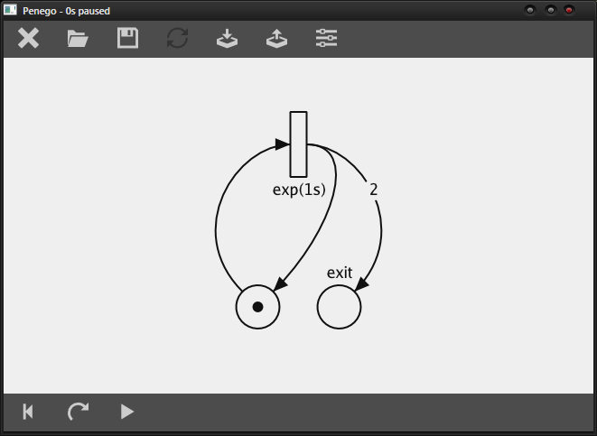
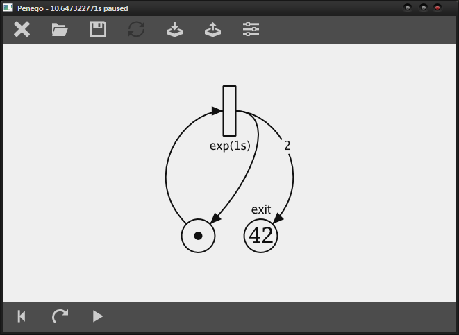
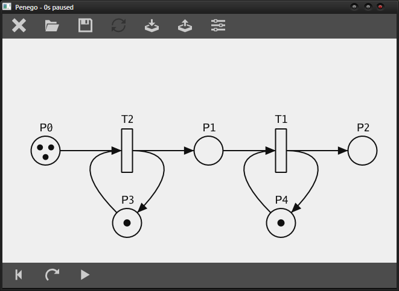
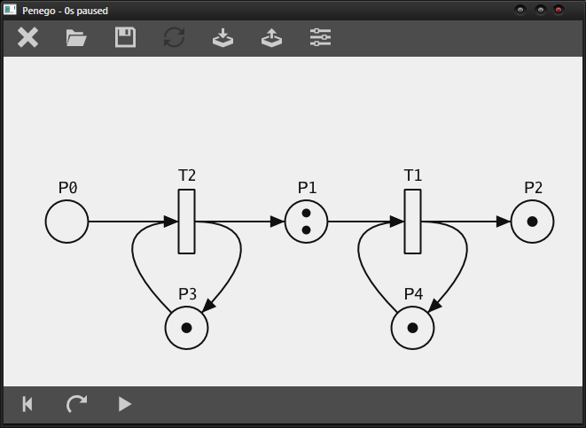

# Penego
*Multi-platform petri-net visualisator written in Go.*


Penego can work with Petri nets having following properties:
- [x] Standard Petri net with indistinguishable tokens
- [x] Prioritized transitions
- [x] Timed transtions
    - [x] Deterministic
    - [x] Stochastic (Random time with given distribution function)
      - [x] Uniform
      - [x] Exponential
      - [x] Erlang
- [ ] Propabilities of transitions
- [x] Weighted arcs
- [x] Inhibitory edges
- [ ] Capacity of places


## Screenshots


|  simple                         |                                   | test 1                          |                                   |
|---------------------------------|-----------------------------------|---------------------------------|-----------------------------------|
|  |  |  |  |


## Build
```
go get -u git.yo2.cz/drahoslav/penego/
```

### Requirements
  - go 1.10+ (see [How to install Go](/INSTALL_GO.md))

#### windows
  - mingw-64 5.x (req. by `andlabs/ui`)

#### linux
  - apt install:
    - `libgl1-mesa-dev xorg-dev`  (req. by `go-gl/gl`, `go-gl/glfw`)
    - `libgtk-3-dev` (req. by `andlabs/ui`)

## Usage
### Gui mode
```bash
./penego [file.pn]
```
Where `file.pn` is file with penego notation.

### Headless mode
```
./penego [file.pn] [-i file.pnml] -o file.ext
```
(Where `ext` has to be one of `png`, `svg` or `pdf`.)

It will either load net saved earlier from penego file,
of it will import net from pnml file produced by another Petri net editor (PIPE5, CPN tools),
and export it to an image based on extension.

## Penego notation
Penego uses its own language to represent Petri nets.

It's meant to be easy to learn, and easier to use.
### Example

```java
g (1)
e ( ) "exit"
----
g -> [exp(30us)] -> g, 2*e
```
### Definition
It consist of two types of lines:
- Place definition. The one with parenthesis `()`
    - Must start with place identificator. (These are used in Transition definitions.)
    - May contain marking of place (number of tokens in place) within parentheses.
    - An optional description in quotes may follow after parentheses.
- Transition definition. The one with brackets `[]`
    - It may start/end with list of incomming/outcomming arcs, followed/foregoing by arrow `->`.
        - Arc means directed edge.
            - Arc is defined by place identificator. Eg. `p`.
            - Irt may be multipled by arcs's weight. Eg `2*p`
            - Arc prefixed with `!` indicates inhibitory edge. Eg `!p`
        - List of arcs is comma-separated.
    - It may contain additional attribute within brackets. Priority or timing.
        - Transition may be timed od may have greater priority, but not both.
        - `[p=N]` where N is non-negative integer indicates transition with given priority N (graeter N means greater priority)
        - `[TIME]` where TIME is some time string (compatible with Duration String format of go's time package) eg. `1s`, `4h15m` or `45ns` indicates transition with constant duration time.
        - `[exp(TIME)]` indicates transition with timed duration given by exponential random function with mean TIME.
         - `[erlang(k,TIME)]` indicates transition with timed duration given by erlang random function with mean TIME and shape k.
        - `[TIME..TIME]` or `[TIME-TIME]` indicates transition with timed duration given by uniform random function with given range.


The text beginning with `//` or `--` is ignored by parser until the end of the line (comments).


### Example of more complex network described in penego notation

```java
// common places
g (1) // generator of students
f (0) "queue"
k (5) "attendant"
v ( ) "serving"
s ( ) "eating"
o ( ) // exit

// places related to interruption
z ( ) // icterus alert
c ( ) // emptying loop
i ( ) "quarantine"

----------------------------

// common transitions
g	-> [exp(3m)] "incoming" -> g,f
f,k	-> [] -> v
v	-> [exp(1m)] -> s,k
s 	-> [10m..15m] -> o
// o	-> [] "outcoming"

// transisions related to interruption
[exp(100d)]  -> z
z,g	-> [p=1] -> c
c,f	-> [p=3] -> c,o
c,v	-> [p=2] -> c,o,k
c,s	-> [p=1] -> c,o
c	-> [p=0] -> i
i	-> [10d] -> g
```

## Modules
Module *penego/net* can be used separately.

Module *penego/gui* can be used separately.

### Usage of *net*
Following petri net…

```
  (1)<-----
   |       |
   |       |    2    exit
    ----->[ ]------->( )
         exp(30s)
```

… can be created like this…

```go
	g := &net.Place{Tokens:1} // generator
	e := &net.Place{Description: "exit"}
	t := &net.Transition{
		Origins: net.Arcs{{1,g}},
		Targets: net.Arcs{{1,g},{2,e}},
		TimeFunc: net.GetExponentialTimeFunc(30*time.Second),
	}
	network = net.New(net.Places{g, e}, net.Transitions{t})
```

… or rather like this using penego notation.

```go
	network, err = net.Parse(`
		g (1)
		e ( ) "exit"
		----
		g -> [exp(30us)] -> g, 2*e
	`)
```

#### TODO simulation
